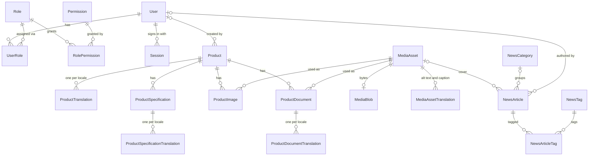
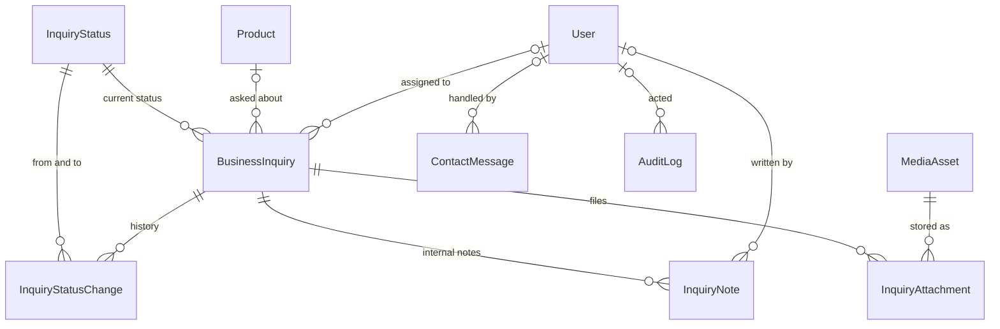

# Database

SQL Server / Azure SQL, accessed through Prisma 7 and the `@prisma/adapter-mssql` driver adapter. This
document explains the model, how to provision and operate it, and what is deliberately absent. The
architecture-level rules (access only through `getDb()`, public queries select public columns only)
are in [ARCHITECTURE.md](./ARCHITECTURE.md) §5.

| Thing                 | Where                                                                     |
| --------------------- | ------------------------------------------------------------------------- |
| Schema                | `prisma/schema.prisma`                                                    |
| Migrations            | `prisma/migrations/` (`0001_init` is hand-extended, see below)            |
| Seed                  | `prisma/seed.ts`, logic in `prisma/seed-data/`                            |
| Domain vocabularies   | `src/lib/domain/statuses.ts`                                              |
| Roles and permissions | `src/server/auth/permissions.ts`                                          |
| Generated client      | `src/generated/prisma` (gitignored; `npm install` runs `prisma generate`) |

Everything on the public site that is _content about the company_ (facts, services, categories, FAQ,
legal, process) is code, not data. The database holds only what changes at runtime.

## 1. Entity overview

32 tables, all in the `dbo` schema.

| Area                      | Tables                                                                                                                                                      | Purpose                                                                                              |
| ------------------------- | ----------------------------------------------------------------------------------------------------------------------------------------------------------- | ---------------------------------------------------------------------------------------------------- |
| Identity and access       | `User`, `Role`, `Permission`, `RolePermission`, `UserRole`, `Session`                                                                                       | Admin accounts, RBAC, server-side sessions (only a SHA-256 of the cookie token is stored).           |
| Media                     | `MediaAsset`, `MediaBlob`, `MediaAssetTranslation`                                                                                                          | Uploaded images and documents: metadata, bytes, and per-locale alt text and captions.                |
| Products                  | `Product`, `ProductTranslation`, `ProductSpecification`, `ProductSpecificationTranslation`, `ProductImage`, `ProductDocument`, `ProductDocumentTranslation` | The catalogue. Empty until real products are entered; never seeded.                                  |
| Inquiries and contact     | `InquiryStatus`, `BusinessInquiry`, `InquiryAttachment`, `InquiryNote`, `InquiryStatusChange`, `ContactMessage`                                             | Buyer inquiries (RFQ), their internal handling and history, and general contact messages.            |
| News                      | `NewsCategory`, `NewsCategoryTranslation`, `NewsTag`, `NewsTagTranslation`, `NewsArticle`, `NewsArticleTag`                                                 | Articles authored per language. Never seeded.                                                        |
| SEO, settings, operations | `SeoMetadata`, `SiteSetting`, `AuditLog`, `RateLimitCounter`                                                                                                | Optional metadata overrides, editable public configuration, audit trail, shared rate-limit counters. |

### Core relationships





### Conventions

- **Keys.** Row ids are `UNIQUEIDENTIFIER` with `newsequentialid()`: not guessable from a URL like an
  integer, and they cluster well. Lookup and configuration tables use their natural key
  (`InquiryStatus.code`, `SiteSetting.key`, `RateLimitCounter.key`). `AuditLog.id` is a `BIGINT`
  identity; Prisma returns it as a `bigint`, so convert it before JSON serialisation.
- **Text.** Everything is `NVARCHAR` (Arabic and Chinese are first-class). Hashes are `CHAR(64)` hex.
- **Time.** `DATETIME2`, always UTC. It carries no zone; `CURRENT_TIMESTAMP` column defaults follow the
  server clock (UTC on Azure SQL). `updatedAt` has no database default (Prisma sets it), so raw SQL inserts must supply it.
- **Collation.** Use the default, `SQL_Latin1_General_CP1_CI_AS`: case-insensitive. Consequences:
  `User.email`, `Product.slug` and every other unique text column are unique regardless of case, so
  `Foo` and `foo` collide. Normalise emails and slugs to lower case before writing. Hash columns must be
  written as lower-case hex.
- **Deletes.** Owned children cascade (translations, specs, images and documents of a product, notes and
  status history of an inquiry, sessions and role links of a user). References to shared parents
  (`MediaAsset`, `User`, `Role`, `NewsCategory`, `NewsTag`) are `NO ACTION`, so deleting a parent that is
  still referenced fails instead of silently removing content; SQL Server also rejects schemas with
  multiple cascade paths, which is one more reason these are not cascades. `BusinessInquiry.productId` and
  `AuditLog.actorId` are `SET NULL`: the inquiry and the log outlive the product or user.
- **Orphans.** Deleting a `BusinessInquiry` removes its `InquiryAttachment` rows but **not** the
  `MediaAsset`/`MediaBlob` rows they pointed to. Code that deletes inquiries (for example to honour an
  erasure request) must delete the attachment media afterwards, in the same transaction.

## 2. Why enums are strings plus a lookup table

The SQL Server connector has no native enums. Vocabularies are therefore plain strings, defined once in
`src/lib/domain/statuses.ts` and enforced in three places:

1. **Application:** zod schemas and TypeScript unions are built from the constants.
2. **Database, simple vocabularies:** a `CHECK` constraint per column, added by the `0001_init`
   migration.
3. **Database, inquiry lifecycle:** the `InquiryStatus` lookup table, referenced by foreign keys from
   `BusinessInquiry.status` and `InquiryStatusChange.fromStatus/toStatus`. It carries what a bare
   constraint cannot: a label, the pipeline order and whether the status is terminal. Its 8 rows are
   inserted by the migration and refreshed by the seed.

| Column                                                              | Constants                    | Enforced by                    |
| ------------------------------------------------------------------- | ---------------------------- | ------------------------------ |
| `Product.status`, `NewsArticle.status`                              | `PUBLISH_STATUSES`           | `CHECK`                        |
| `MediaAsset.kind`                                                   | `MEDIA_KINDS`                | `CHECK`                        |
| `MediaAsset.visibility`                                             | `MEDIA_VISIBILITIES`         | `CHECK`                        |
| `ProductDocument.kind`                                              | `DOCUMENT_KINDS`             | `CHECK`                        |
| `ContactMessage.status`                                             | `CONTACT_MESSAGE_STATUSES`   | `CHECK`                        |
| `SeoMetadata.scope`                                                 | `SEO_SCOPES`                 | `CHECK`                        |
| `BusinessInquiry.status`, `InquiryStatusChange.fromStatus/toStatus` | `INQUIRY_STATUS_DEFINITIONS` | foreign key to `InquiryStatus` |

The `CHECK` constraints compare with the binary collation `Latin1_General_100_BIN2`, so `published` is
rejected even though the database collation is case-insensitive; application code compares these values
with `===`. The foreign key to `InquiryStatus` follows the column collation and is _not_ case-sensitive,
so always write the constants, never user input.

`locale` columns are validated in code only, so adding a language needs no migration.

**Adding or changing a value.** Edit `statuses.ts`, then add a migration that drops and re-creates the
constraint (or inserts or updates the lookup row):

```sql
ALTER TABLE [dbo].[Product] DROP CONSTRAINT [Product_status_check];
ALTER TABLE [dbo].[Product] ADD CONSTRAINT [Product_status_check]
  CHECK ([status] COLLATE Latin1_General_100_BIN2 IN (N'DRAFT', N'PUBLISHED', N'ARCHIVED', N'SCHEDULED'));
```

`prisma/migrations.test.ts` parses every migration (the last definition of a constraint wins) and fails
until the SQL and `statuses.ts` agree, including the `INQUIRY_STATUS_DEFINITIONS` rows.

## 3. The translation-table pattern

Locale-specific text lives in a child table named `<Entity>Translation`, one row per locale, with a
unique key on `(<entity>Id, locale)`:

| Parent                    | Translation table                               | Translated fields                                             |
| ------------------------- | ----------------------------------------------- | ------------------------------------------------------------- |
| `Product`                 | `ProductTranslation`                            | name, short description, description, applications, packaging |
| `ProductSpecification`    | `ProductSpecificationTranslation`               | label, value                                                  |
| `ProductDocument`         | `ProductDocumentTranslation`                    | title                                                         |
| `MediaAsset`              | `MediaAssetTranslation`                         | alt text, caption                                             |
| `NewsCategory`, `NewsTag` | `NewsCategoryTranslation`, `NewsTagTranslation` | name                                                          |

Language-neutral attributes (slug, category, status, ordering, dates) stay on the parent, so a product
has one URL slug in all languages and one publication state. A missing translation is a missing row, not
an empty string; readers fall back to `en`, and the admin _translation coverage_ report is an
anti-join for the missing `(entity, locale)` pairs. Translations are deleted with their parent.

`NewsArticle` is the exception: articles are written per language, not translated field by field. Each
language version is its own row with its own `locale`, `slug`, `title` and `content`, unique on
`(locale, slug)`. Versions of the same story share a `translationGroupId`, which is how `hreflang`
alternates are found.

The company's legal names and license text are never translated and are not stored here at all.

## 4. Concurrency

`Product`, `BusinessInquiry` and `NewsArticle` carry `version INT DEFAULT 0` for optimistic
concurrency. Read the row (including `version`), then write conditionally and bump it:

```ts
const { count } = await db.product.updateMany({
  where: { id, version },
  data: { ...changes, version: { increment: 1 } },
});
if (count === 0) throw new ConflictError(); // someone else saved first: reload and re-apply
```

`updatedAt` is maintained by Prisma and is informational; `version` is what guards writes. Other
mutable rows (`SeoMetadata`, `SiteSetting`, `ContactMessage`) are low-contention and last-write-wins.
A status change on an inquiry should update `BusinessInquiry` (with the version check) and insert an
`InquiryStatusChange` row in one transaction.

## 5. Media storage

Uploads live in the database so the site needs no extra infrastructure and backups cover files.

- `MediaAsset` holds metadata only: `kind`, `visibility` (`PUBLIC` or `PRIVATE`), a sanitised display
  name, the MIME type verified from the file signature, size, SHA-256 (indexed, for duplicate
  detection), image dimensions and the uploader.
- `MediaBlob` holds the bytes (`VARBINARY(MAX)`), one row per asset, deleted with it. It is a separate
  table so listing and joining assets never drags binary data along; read the blob only in the download
  route (`select: { data: true }`).
- `MediaAssetTranslation` holds alt text and captions per locale.
- Private assets are served only through an authorised route handler; public ones through the media
  route. `UPLOAD_MAX_BYTES` (default 5 MiB) bounds each file, so `sizeBytes INT` is ample.

The cost is database size (check your Azure SQL tier's maximum) and every download going through the
database. **Moving to object storage** touches only the storage service:

1. Add a second storage implementation (for example Azure Blob Storage) behind the same interface.
2. Add a nullable `storageKey NVARCHAR(400)` to `MediaAsset` in a migration.
3. Copy each `MediaBlob.data` to the container, in batches, and record the key. Verify against `sha256`.
4. Serve from `storageKey` when set and fall back to `MediaBlob` otherwise. Public URLs are keyed by
   asset id and do not change, so pages, emails and SEO metadata keep working.
5. When every asset has a key, drop `MediaBlob` in a migration and rebuild the database's indexes to
   reclaim the space.

## 6. Indexes

Unique constraints and indexes, and the query each one serves. The widest index key is 508 bytes
(`email`), well under SQL Server's 1,700-byte limit for non-clustered keys; no index contains an
`NVARCHAR(MAX)` column.

| Table                                                                                                                                                           | Index                                                                                             | Serves                                                                                                                            |
| --------------------------------------------------------------------------------------------------------------------------------------------------------------- | ------------------------------------------------------------------------------------------------- | --------------------------------------------------------------------------------------------------------------------------------- |
| `User`                                                                                                                                                          | unique `email`                                                                                    | sign-in lookup; one account per address                                                                                           |
| `Role`, `Permission`                                                                                                                                            | unique `key`                                                                                      | seed upserts and permission checks by key                                                                                         |
| `UserRole`                                                                                                                                                      | `(roleId)`                                                                                        | users holding a role; role foreign key                                                                                            |
| `Session`                                                                                                                                                       | unique `tokenHash`; `(userId)`; `(expiresAt)`                                                     | session lookup by cookie hash; revoke a user's sessions; purge expired                                                            |
| `MediaAsset`                                                                                                                                                    | `(kind, visibility)`; `(sha256)`                                                                  | media library filters; duplicate detection on upload                                                                              |
| `MediaAssetTranslation`, `ProductTranslation`, `ProductSpecificationTranslation`, `ProductDocumentTranslation`, `NewsCategoryTranslation`, `NewsTagTranslation` | unique `(parentId, locale)`                                                                       | one row per language; fetch a locale; parent-delete cascade                                                                       |
| `Product`                                                                                                                                                       | unique `slug`; `(categorySlug, status, sortOrder)`; `(status, publishedAt)`                       | product page; category listing in display order; latest and sitemap                                                               |
| `ProductSpecification`, `ProductImage`                                                                                                                          | `(productId, sortOrder)`                                                                          | ordered children of a product                                                                                                     |
| `ProductImage`, `ProductDocument`                                                                                                                               | unique `(productId, mediaAssetId)`                                                                | the same asset cannot be attached twice                                                                                           |
| `BusinessInquiry`                                                                                                                                               | unique `referenceCode`; `(status, createdAt)`; `(email)`; `(ipHash, createdAt)`; `(assignedToId)` | buyer or support lookup by reference; the admin pipeline; repeat buyers and per-email limits; per-IP abuse limits; "my inquiries" |
| `InquiryAttachment`                                                                                                                                             | unique `(inquiryId, mediaAssetId)`                                                                | no duplicate attachments                                                                                                          |
| `InquiryNote`, `InquiryStatusChange`                                                                                                                            | `(inquiryId, createdAt)`                                                                          | inquiry timeline                                                                                                                  |
| `ContactMessage`                                                                                                                                                | unique `referenceCode`; `(status, createdAt)`; `(ipHash, createdAt)`                              | lookup; admin inbox; abuse limits                                                                                                 |
| `NewsCategory`, `NewsTag`                                                                                                                                       | unique `slug`                                                                                     | category and tag pages                                                                                                            |
| `NewsArticle`                                                                                                                                                   | unique `(locale, slug)`; `(locale, status, publishedAt)`; `(translationGroupId)`                  | article route; published listing per language; `hreflang` alternates                                                              |
| `NewsArticleTag`                                                                                                                                                | `(tagId)`                                                                                         | articles for a tag                                                                                                                |
| `SeoMetadata`                                                                                                                                                   | unique `(scope, refKey, locale)`                                                                  | override lookup for a page                                                                                                        |
| `AuditLog`                                                                                                                                                      | `(entityType, entityId)`; `(actorId, createdAt)`; `(createdAt)`                                   | history of one record; activity of one user; recent feed and retention purges                                                     |
| `RateLimitCounter`                                                                                                                                              | `(resetAt)`                                                                                       | purge expired counters                                                                                                            |

**Deliberately not added** (add them with a hand-written migration when the need is measured):

- Indexes on foreign-key columns that are only ever filtered by the parent: `ProductImage.mediaAssetId`,
  `ProductDocument.mediaAssetId`, `InquiryAttachment.mediaAssetId`, `NewsArticle.coverMediaId` and
  `categoryId`, `BusinessInquiry.productId`, and the `createdById`/`authorId`/`handledById` user
  references. SQL Server scans the child when a parent is deleted, which is negligible at this scale.
- A filtered unique index on `ProductImage(productId) WHERE isPrimary = 1` would guarantee at most one
  primary image, but it also forces every writer to clear the old primary before setting a new one. Prisma
  cannot express it, so it would live outside the schema and `migrate dev` may propose dropping it.
  Enforce it in the repository first.
- Full-text search over product names and descriptions (SQL Server full-text catalogues are not
  expressible in Prisma). Worth adding once a real catalogue exists.

## 7. Provisioning

The driver adapter connects over **TCP** with SQL authentication (Microsoft Entra options exist, see the
adapter README). LocalDB and SQL Server Express with TCP disabled therefore do not work; use Azure SQL,
SQL Server with TCP enabled, or a container.

### Azure SQL Database

```bash
az group create --name <rg> --location <region>
az sql server create --name <server> --resource-group <rg> --location <region> \
  --admin-user <admin-login> --admin-password '<generated-password>'
az sql db create --resource-group <rg> --server <server> --name shaheen_sky \
  --edition GeneralPurpose --compute-model Serverless --family Gen5 --capacity 1 \
  --auto-pause-delay 60
az sql server firewall-rule create --resource-group <rg> --server <server> --name app \
  --start-ip-address <ip> --end-ip-address <ip>
```

The sizing above is a starting point; choose tier and backup redundancy for your load and recovery
needs. Keep the default collation. Allow only the addresses that need access (the hosting platform's
outbound IPs, your own for migrations) or use a private endpoint; avoid the blanket "Allow Azure
services" rule. With serverless auto-pause, the first request after a pause can be slow; raise
`connectTimeout` (see below). A connection failure shows visitors a truthful "could not save" message and
never a fake success.

### SQL Server (self-hosted or development)

Enable TCP, mixed-mode authentication and encryption, then create an empty database with the default
collation. For a throwaway development server:

```bash
docker run -e ACCEPT_EULA=Y -e MSSQL_SA_PASSWORD='<generated-password>' -p 1433:1433 -d \
  mcr.microsoft.com/mssql/server:2022-latest
```

```sql
CREATE DATABASE shaheen_sky COLLATE SQL_Latin1_General_CP1_CI_AS;
```

### Least-privilege users

Use two identities: one that changes the schema (migrations) and one that only reads and writes rows
(the running site). Run this in the application database (on Azure SQL these are contained users; on
self-hosted SQL Server create logins first and map users to them, or enable contained databases):

```sql
CREATE USER [shaheen_app] WITH PASSWORD = '<generated-password>';
ALTER ROLE db_datareader ADD MEMBER [shaheen_app];
ALTER ROLE db_datawriter ADD MEMBER [shaheen_app];

CREATE USER [shaheen_migrator] WITH PASSWORD = '<generated-password>';
ALTER ROLE db_owner ADD MEMBER [shaheen_migrator];
```

The site's `DATABASE_URL` uses `shaheen_app`. Migrations and the seed run with `shaheen_migrator`'s URL
(the seed only writes rows, so the app user also works for it once the schema exists).

## 8. `DATABASE_URL`

```
sqlserver://<host>:<port>;database=<db>;user=<user>;password=<password>;encrypt=true;trustServerCertificate=false
```

- Azure SQL: `sqlserver://<server>.database.windows.net:1433;database=shaheen_sky;user=shaheen_app;password=<password>;encrypt=true`
- Local container with a self-signed certificate (development only):
  `sqlserver://localhost:1433;database=shaheen_sky;user=sa;password=<password>;encrypt=true;trustServerCertificate=true`

Parameters are separated by `;`, and values are literal (no URL encoding). A value that contains `;` must
be wrapped in braces, `password={a;b}`; braces inside a value are not supported, so generate passwords
without `;`, `{` and `}`. Always set `encrypt=true`. Supported options: `database`, `user`, `password`,
`encrypt`, `trustServerCertificate`, `connectionLimit` (pool size), `connectTimeout` and `socketTimeout`
(**milliseconds**, for example `connectTimeout=30000`), `poolTimeout` (seconds), `applicationName`,
`isolationLevel`.

The value is a secret: it lives in the environment (`.env.local` for development, the host's secret store
in production), is never committed and never prefixed `NEXT_PUBLIC_`. Without it the public pages still
render and database-backed features report themselves unavailable.

## 9. Applying migrations

```bash
npm run db:migrate        # prisma migrate deploy
npx prisma migrate status # what is applied, what is pending
```

`migrate deploy` applies pending migrations in order and records them in `_prisma_migrations`. It never
resets the database and never creates migrations, so it is the command for staging and production. Set `DATABASE_URL` in the
process environment first (`export DATABASE_URL='...'` in bash, `$env:DATABASE_URL = '...'` in
PowerShell): the Prisma CLI does not read `.env` or `.env.local`. Only the seed loads those files.

`0001_init` is Prisma's generated DDL for the whole schema, followed by a clearly marked hand-written
block: the `CHECK` constraints and the 8 `InquiryStatus` rows. It runs in a single transaction, so a
failure leaves nothing behind. The folder is named `0001_init` rather than with a timestamp; Prisma's
timestamped names for later migrations sort after it.

**Changing the schema.** Edit `schema.prisma`, then generate the migration against a local SQL Server:

```bash
npm run db:migrate:dev -- --create-only --name <change>
```

`migrate dev` creates a temporary shadow database, so the login must be allowed to create databases. Read
the generated SQL, add whatever Prisma cannot express, apply it, and run `npm test`. Never edit a
migration that has been applied anywhere; add a new one. The files must keep LF line endings
(`.gitattributes` enforces this) because Prisma checksums their exact bytes.

There are no down migrations. Fix forward with a new migration; for a destructive change take a restore
point first. If a migration fails midway, run `npx prisma migrate resolve --rolled-back <name>` after
fixing the cause.

## 10. Seeding

```bash
npm run db:seed
```

Safe to run after every deploy: every write is an upsert on a natural key.

| Writes                                   | Source                                       |
| ---------------------------------------- | -------------------------------------------- |
| 8 `InquiryStatus` rows                   | `INQUIRY_STATUS_DEFINITIONS`                 |
| `Permission` rows                        | `PERMISSIONS`                                |
| the four `Role` rows (`isSystem = true`) | `ROLE_DEFINITIONS`                           |
| `RolePermission` links                   | each role's `permissions`                    |
| optionally, the first `SUPER_ADMIN`      | `SEED_ADMIN_EMAIL` and `SEED_ADMIN_PASSWORD` |

It never writes products, news, inquiries, FAQs or any other business content, and it has no default
password. Labels and descriptions that drifted from the code are refreshed. The seed is **additive for
grants**: it never removes a `RolePermission` link, so extra grants added in the admin UI survive, but a
baseline grant removed in the UI is restored on the next run. To take a baseline grant away for good,
change `ROLE_DEFINITIONS`. Permissions deleted from the code stay in the table until removed by hand.

The seed reads `DATABASE_URL` from the environment, falling back to `.env.local` and then `.env`
(the real environment always wins).

## 11. Creating the first admin

1. Set both variables for a single run, using a strong password (12 to 128 characters, not a common
   password, not derived from the email):
   `SEED_ADMIN_EMAIL=you@yourcompany.example` and `SEED_ADMIN_PASSWORD=<generated-password>`.
2. `npm run db:seed`. The account is created with the `SUPER_ADMIN` role and an audit row
   (`user.created_via_seed`). The password is hashed with the same scrypt routine the sign-in uses and is
   never printed or logged.
3. Sign in at `/admin`, then **remove `SEED_ADMIN_PASSWORD` from the environment**. Later runs treat
   "only one variable set" as "nothing to do".
4. Create further users from the admin area.

Rules the seed follows: both variables must be set or nothing is created; if both are set but the email
is malformed or the password too weak, the whole seed aborts before writing anything; if an account with
that email already exists it is **left untouched** (no password reset, no role change), so re-running the
seed is never a way to take over an account. To reset a password or repair an account, use
`npm run admin:create -- --email <email> --name <name>` (it prompts for the password with hidden input and
updates an existing user; see `scripts/create-admin.ts`).

## 12. Backup and retention

- **Azure SQL** takes automated backups and offers point-in-time restore (7 days by default, up to 35
  configurable); add long-term retention if required. Because media is stored in the database, one
  restore brings back files and rows consistently.
- **Self-hosted SQL Server:** full, differential and transaction-log backups on a schedule, copied off
  the machine. A backup that has never been restored is not a backup: rehearse a restore.
- Take a restore point (or a manual backup) before any destructive migration.

Nothing in the database purges itself. Decide and schedule:

| Data                                                                    | Suggested handling                                                                                                                                                                                |
| ----------------------------------------------------------------------- | ------------------------------------------------------------------------------------------------------------------------------------------------------------------------------------------------- |
| `Session` rows with `expiresAt` in the past                             | delete routinely (indexed)                                                                                                                                                                        |
| `RateLimitCounter` rows with `resetAt` in the past                      | delete routinely (indexed)                                                                                                                                                                        |
| `AuditLog`                                                              | keep for a period set by policy; purge by `createdAt` (indexed)                                                                                                                                   |
| `BusinessInquiry`, `InquiryNote`, `InquiryAttachment`, `ContactMessage` | contain personal data: the retention period and the erasure procedure are business and legal decisions that have not been made; when deleting, also delete the attachment media (see Conventions) |

```sql
DELETE FROM [dbo].[Session] WHERE [expiresAt] < SYSUTCDATETIME();
DELETE FROM [dbo].[RateLimitCounter] WHERE [resetAt] < SYSUTCDATETIME();
```

IP addresses are stored only as keyed hashes (`ipHash`), keyed by `AUTH_SECRET`. Rotating that secret
makes old hashes unmatchable, which only resets abuse-tracking history.

## 13. What is intentionally not modelled

- **Services, product categories, FAQs, legal pages, the trade process, company facts and the registered
  business scope.** They are code (`src/config`, `src/content`, `src/messages`) because they are mapped
  to the registered business scope, drive routing and SEO, need reviewed copy, and must render with no
  database. The admin lists them read-only. Consequently `Product.categorySlug` and
  `BusinessInquiry.categorySlug` carry no foreign key and are validated against `src/content/categories`
  when written; renaming a category slug in code needs a data migration for existing rows.
- **A generic `Translation` table.** Replaced by the per-entity translation tables above.
- **Prices, minimum order quantities, stock levels, lead times and certifications.** The business has
  supplied none, and the site never implies them. `ProductDocument.kind = CERTIFICATE` only classifies a
  file someone uploaded.
- **Customers, companies, orders, quotations and payments.** An inquiry is a record of a request, not a
  customer account. These belong to a future trade platform.
- **Password-reset tokens, email verification, MFA secrets and third-party sign-in accounts.** Admin
  accounts are created by an administrator or the seed.
